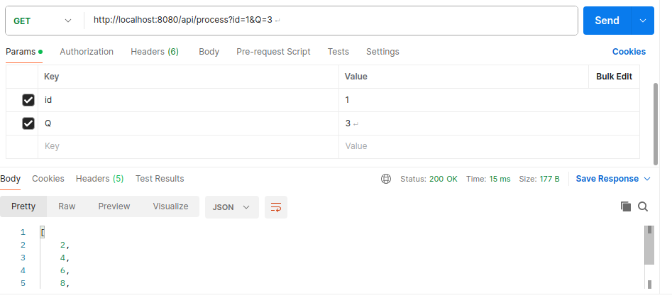

# bartender
PRUEBA Eres un bar ténder del bar más famoso de tu ciudad.
 Hay un arreglo de vasos numerados que está representado por el arreglo A. 
 Adicional se tiene un arreglo con números primos representado por P.


 Este ejemplo se realiza con las distintas caracteristicas antes mensionadas

En cada iteración Qi, retira cada vaso de la parte superior del arreglo A. Determina si el número
del plato es divisible uniformemente por el Pi número primo. Si lo es, agréguelo en un arreglo B.
En caso contrario, añádalo a un arreglo Ai. Guarda los valores de B en el arreglo Respuesta. En
la siguiente iteración, haz lo mismo con los valores del arreglo Ai. Una vez completado el
número necesario de iteraciones Q, almacene los valores restantes de Ai, al final de Respuesta.


En la base de datos para la prueba se utiliza h2 un motor de base de datos en tiempo de ejecucion.

en las pruebas se realiza en el puerto 8080 utilizando una  peticion http de tipo get en postman para verificar el funcionamiento del sistema 




API probar
http://localhost:8080/api/process?id=1&Q=3


Pasos para ejecutar la aplicacion

```
# Clona el repositorio
git clone https://github.com/emerson14/bartender.git


```
# instalar las depencias del proyecto y generar el jar .

mvm clean install
 

```
# Crear imagen de la aplicacion y ejecutar en un contenedor.

 docker-compose up --build

